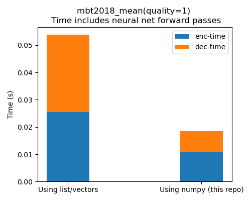

# Python interface for ryg_rans entropy coding

This repository is based on [CompressAI](https://github.com/InterDigitalInc/CompressAI) and [ryg_rans](https://github.com/rygorous/ryg_rans) with minor modifications to make ANS easier to use for PyTorch models.

- The C++ function accepts NumPy inputs (instead of Python lists)
- Supports CompressAI models with minimal changes
- Faster than CompressAI's `encode_with_indexes()` and `decode_with_indexes()`


## Install
```bash
mkdir build
cd build

# Build the C++ extension
cmake ..
make
```

Then `test-compressai.ipynb` should work.


## Speed comparison

### End-to-end compression of Kodak images using `compressai.zoo.mbt2018_mean`

- **Image size:** 512x768
    - Speed averaged over 24 images
- **GPU (neural networks forward):** Nvidia RTX 4090
- **CPU (entropy coding, using a single thread):** Intel 10700k

<p align="center">

</p>
